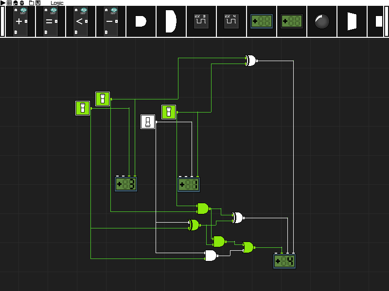

# Logic
Logic circuit simulator



# Controls
Click and drag components on the toolbar onto the canvas.
Click and drag on component nodes to create wires.
Click and drag on a placed component to move it.
Click and drag on the canvas to move view.

Right click on a component/wire to destroy it.

Right click while making a wire to change its shape.
Left click on a placed wire to change its shape.

Right click while moving a component to rotate it.

Some components can be clicked.

Buttons in top-left corner can be clicked.
In order, they are pause/play simulation, toggle grid, reset camera view to home,
delete all components, load from file, save from file.

# Saving and loading circuits

Use the load and save button on the titlebar to load and save.

All saves are written to the saves/ folder.

File format is specified in the include/save.h header file.

# Building

To build simply do
```
make
```

and launch with
```
./logic
```

Libraries required are 'SDL2', 'SDL2_image' and 'SDL2_ttf'.
Check your distribution mantainer for how to install these libraries.

# Custom Components
The simulator builds all the components stored in the 'comp/' folder.
It builds the C file and calls \_\_load\_\_() to get the component defined in the file.

Example File (AND.c)
```
#define NAME "AND"
#define IOFF "AND.png"
#define ION  "ANDon.png"

//void render(component*, SDL_Renderer* R, texture* texs, int tex_count);
//void click (component*, int state, int ms);
//void destroy(component*);

void update(component* c, int frame) {
	c->out[0].state = c->in[0].state && c->in[1].state;
	c->state = c->out[0].state;
}

component c_AND = {
	NAME,
	0,         //int state
	0,0,24,24, //int x,y,w,h

	//img_off, img_on
	  IOFF   , ION,  

	2,1,       //in_count, out_count

	//0 x y NULL
	{{0, 0 , 6}, {0, 0, 18} }, //nodes in 
	{{0, 24, 12}}, //nodes out

	0, //int rotation;
	0, //long long var;

	update,       //void (*update)(component*, int frame);
	NULL,         //void (*render)(component*, SDL_Renderer*, texture*, int);
	NULL,         //void (*click) (component*, int, int);
	NULL,         //void (*destroy)(component*);
};

component* __load__() {
	return &c_AND;
}
```

The three defines on top define the components name and image for its ON/OFF state.

The 'state' of a component is purely visual, switching between its ON/OFF image.

The amount of input and output nodes that your component has must be specified,
each node specification in the nodes in and nodes out array has the format of:
```
{starting 0/1 state, offset x position, offset y position}
```
The offset is the offset from the parent components position.

'rotation' is the orientation of the component. If you don't want your component to rotate, you can set it to 0 everytime in the update function.

'var' is an integer variable that can be used for computation in your components operation (e.g. its used to store the number in the counter).

The four last entries are function pointers, they are all *optional*, but you will want an
update function 99.9% guaranteed.

The update function is called every frame, the frame argument passed in is the current
frame that the logic simulation is on (can be used for synchronisation).

The render function is called when the component is being rendered, allowing for custom rendering
(if a render function is set, the components image will NOT be drawn, only its nodes). The arguments given
are the rendering context, an array to the current loaded textures and how many textures are loaded.

The click function is called when a component is left clicked, the second argument is the STATE,
-1 for inital left button click frame, 0 for when it's held and 1 for the button up frame. The
last argument is how long the button has been held for.

The destroy function is called when the component is deleted in any way. For example, if you use var
as a pointer to some allocated memory, you can use destroy to free the memory.

**These functions MUST be called 'update', 'render', 'click' and 'destroy' respectively otherwise they will
not work.**

**\_\_load\_\_() MUST return a pointer to the components struct specification you just made**

'include/comp.h' is pre-included for you. Component struct definition is in this header file.
For custom rendering capabilities you must put
```
#include <SDL2/SDL.h>
#include "tex.h"
```
in your component file. Look at the SDL2 wiki to see how to render with an SDL_Renderer* and
textures.
